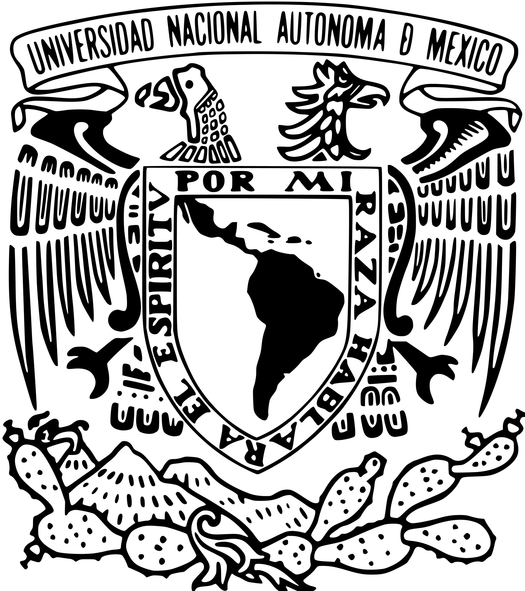

::: {.portada}
# Transición hacia Energías Renovables {.titulo}

::: {.subtitulo}
Análisis de la adopción de energías renovables y los factores que influyen en su avance.
:::

::: {.divisor}
:::

::: {.institucional}
Proyecto final del Módulo 8 "Comunicación de resultados" 
Diplomado "Introducción Analítica a la Ciencia de Datos"
:::
:::

::: {.cuerpo}
Este sitio presenta el proyecto final del Módulo 8 del Diplomado "Introducción Analítica a la Ciencia de Datos". En él, analizamos la transición hacia las energías renovables a partir de datos del Statistical Review of World Energy (Energy Institute) y del PIB per cápita del Banco Mundial.

El estudio busca identificar qué países han avanzado con mayor rapidez en la adopción de fuentes renovables y explorar qué factores, como el nivel de desarrollo económico, se relacionan con una mayor penetración de estas fuentes.

En este sitio encontrarás las bases de datos utilizadas, el reporte completo del estudio y un dashboard interactivo con los principales resultados.
:::

::: {.equipo}
Equipo 2: Aguilera Yáñez Mariana, Alvarado Arce Axel Eduardo, Canseco Galván Tanivet Leonor, García Soto Kevin, Hernández Mareles Francisco Javier, Rendón Cardoso Karla y Suárez Urbano David Hiram.
:::
